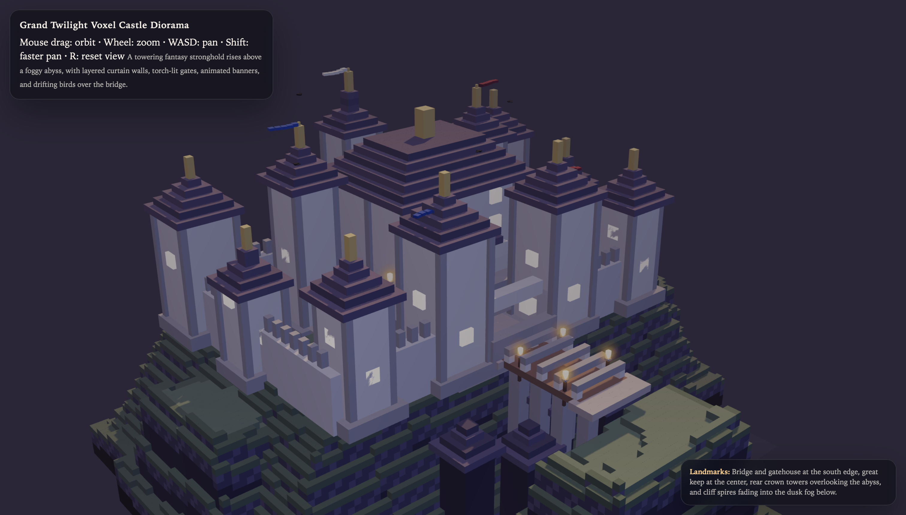

# Voxel Castle Diorama



절벽 위에 세운 복셀 성을 Three.js로 구현한 3D 디오라마입니다. 하나의 `index.html`만으로 실행되며, 별도 빌드 과정 없이 브라우저에서 바로 확인할 수 있습니다.

## 소개

데모: [jinhyuk9714.github.io/voxel-castle-diorama](https://jinhyuk9714.github.io/voxel-castle-diorama/)

이 프로젝트는 황혼 분위기의 판타지 성을 웹에서 바로 둘러볼 수 있게 만든 작업입니다. 성벽, 중앙 성채, 다리, 횃불, 깃발, 새의 움직임을 코드로 만들었고, 외부 3D 모델 없이 장면 전체를 브라우저에서 렌더링합니다.

## 핵심 포인트

- 단일 HTML 파일로 실행되는 Three.js scene
- CDN import map을 이용한 Three.js와 OrbitControls 로딩
- 절벽 지형과 성 구조물을 코드로 생성한 복셀 스타일 디오라마
- 황혼 조명, 안개, 횃불, 깃발, 새 애니메이션 포함
- 마우스와 키보드로 탐색 가능한 카메라 조작
- WebGL 로딩 실패를 알려주는 runtime failure guard 포함

## 조작 방법

- 마우스 드래그: 회전
- 휠: 확대/축소
- `W / A / S / D`: 화면 이동
- `Shift`: 빠른 이동
- `R`: 시점 초기화

## 실행 방법

```bash
git clone https://github.com/jinhyuk9714/voxel-castle-diorama.git
cd voxel-castle-diorama
python3 -m http.server 4173
```

브라우저에서 `http://127.0.0.1:4173`으로 접속하면 됩니다.

## 사용 기술

- Three.js
- HTML
- CSS
- JavaScript
- Node test runner

## 파일 구조

```text
.
├─ index.html               # scene, style, interaction이 들어 있는 단일 실행 파일
├─ image/castle-overview.png
├─ test/index.test.mjs      # HTML shell과 README 링크 검증
└─ .nojekyll                # GitHub Pages 정적 배포용 marker
```

## 검증

```bash
node --test
```

테스트는 `index.html`의 scene 구성 요소, 기본 카메라 위치, 조명 프로필, README의 데모 링크, `.nojekyll` marker를 확인합니다.

## 링크

- 저장소: [github.com/jinhyuk9714/voxel-castle-diorama](https://github.com/jinhyuk9714/voxel-castle-diorama)
